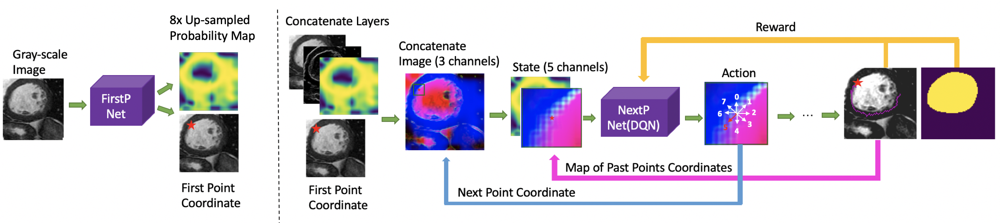

# RL_segmentation

This is the code for "Medical Image Segmentation with Deep Reinforcement Learning"

The proposed model consists of two neural networks. The first is FirstP-Net, whose goal is to find the first edge point and generate a probability map of the edge points positions. The second is NextP-Net, which locates the next point based on the previous edge point and image information. This model segments the image by finding the edge points step by step and ultimately obtaining a closed and accurate segmentation result.

Figure 1. The overall process of the proposed system: FirstP-Net finds the first edge point and generates a probability map of edge points positions. NextP-Net locates the next point based on the previous edge point and image information.

Figure 2. The ground truth (GT) boundary is plotted in blue and the magenta dots are the points found by NextP-Net. The red pentagram represents the first edge point found by FirstP-Net. The first and third rows are the original results and the second and fourth rows are the smoothed results after post-processing.

## Requirements
* Python2.7
* torch 0.4.0
* torchvision 0.2.1
* matplotlib 2.2.3
* numpy 1.16.4
* opencv-python 4.1.0.25
* scikit-image 0.14.3
* scikit-learn 0.20.4
* shapely 1.6.4.post2
* cffi
* scipy

## Installation
1. Clone this repository.

        git clone https://github.com/Mayy1994/RL_segmentation.git

2. As we use a crop and resize function like that in Fast R-CNN (https://github.com/longcw/RoIAlign.pytorch) to fix the size of the state, it needs to be built with the right -arch option for Cuda support before training. (https://github.com/multimodallearning/pytorch-mask-rcnn)

    | GPU | arch |
    | --- | --- |
    | TitanX | sm_52 |
    | GTX 960M | sm_50 |
    | GTX 1070 | sm_61 |
    | GTX 1080 (Ti) | sm_61 |

        cd nms/src/cuda/
        nvcc -c -o nms_kernel.cu.o nms_kernel.cu -x cu -Xcompiler -fPIC -arch=[arch]
        cd ../../
        python build.py
        cd ../

        cd roialign/roi_align/src/cuda/
        nvcc -c -o crop_and_resize_kernel.cu.o crop_and_resize_kernel.cu -x cu -Xcompiler -fPIC -arch=[arch]
        cd ../../
        python build.py
        cd ../../
        
3. Run train.py to train the DQN agent on 15 subjects from the ACDC dataset, or you can run val.py to test the proposed model on this dataset.

## Training curves and results

### Ablation study
* State: 

Experiment 0: grayscale layer, Sobel layer, cropped probability map, global probability map and past points map.

Experiment 1: grayscale layer, Sobel layer and past points map layer. 

Experiment 2: grayscale layer, Sobel layer, cropped probability map, global probability map.

* Reward:

Experiment 3: employing the difference IoU reward as the final immediate reward.

Figure 3. The changes in three separate reward values, total reward value, F-measure accuracy and APD accuracy according to the learning iterations during the training process on ACDC dataset.

### Comparison with baseline

